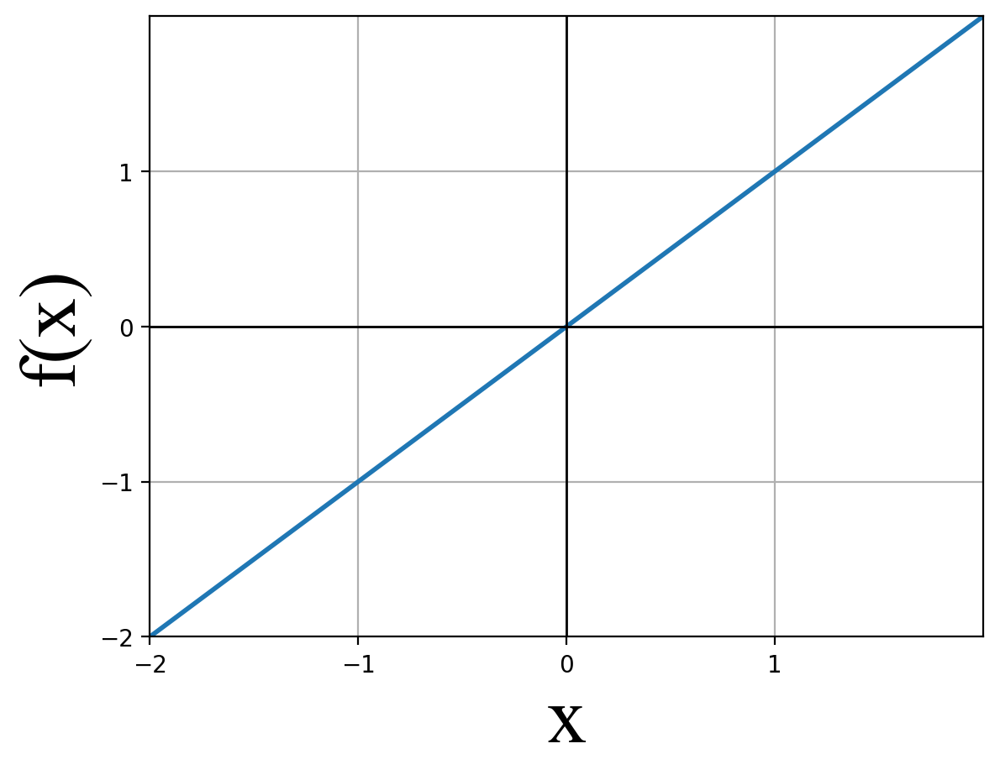
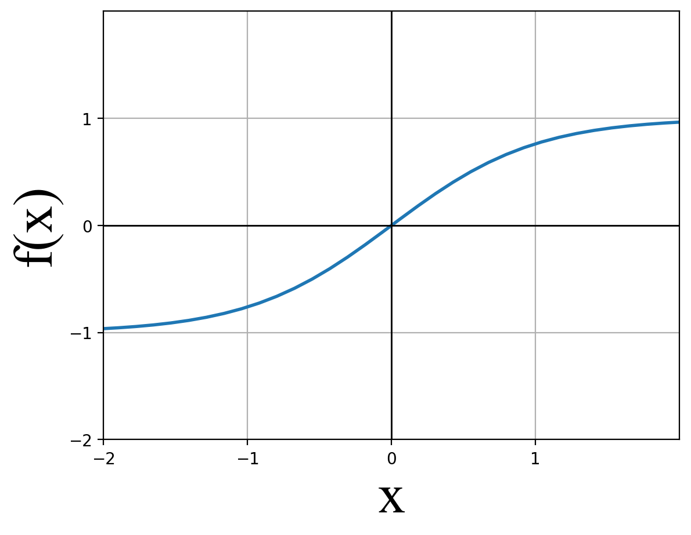
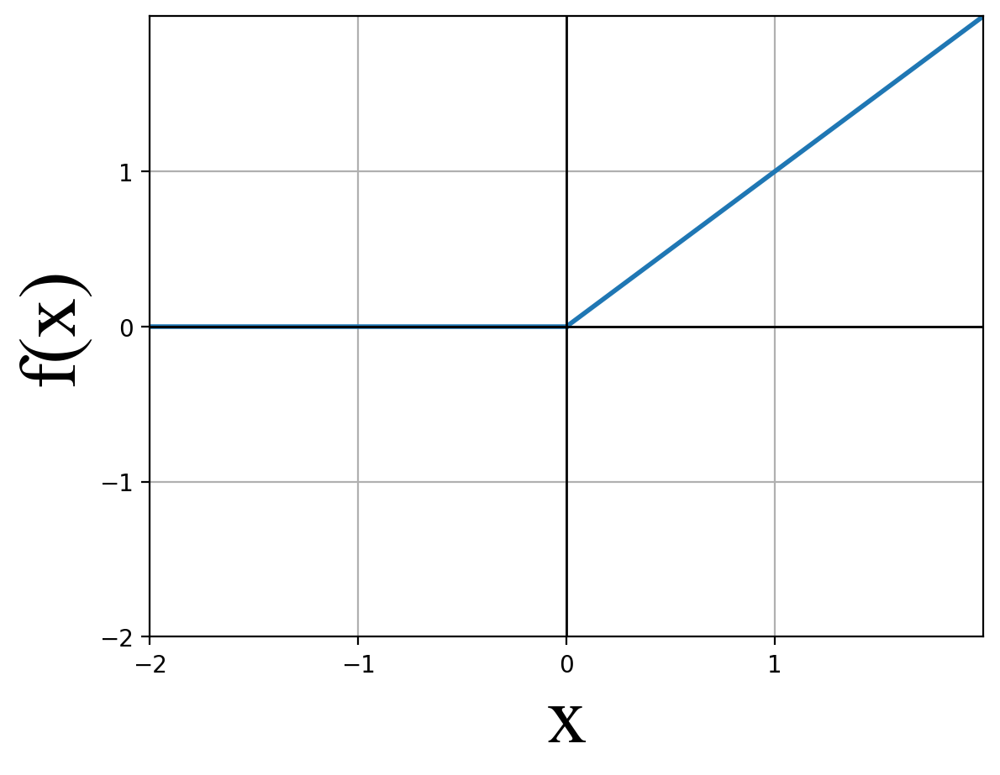

# Experiments

This section is a quick start guide on how to change elements of an experiment.

## Problem Statement

Each experiment has a specific problem statement associated with it that defines the problem that the RL agent is trying to solve and may include the following elements:

- **Initial Conditions** - For each variable in the simulation are the initial conditions fixed or random with a mean and standard deviation? For example, the initial distance of a spacecraft from the origin along each axis may be defined by a mean distance and some standard deviation so that the spacecraft learns to dock from a bunch of different initial starting conditions.
- **Actions** - What actions does the RL agent take in the environment? For example, spacecraft actions might be a force in x, y, and z directions.
- **State/Observation** - What are the states or observations used as inputs to the neural network?
- **State Transition** - How do the actions change the state between timesteps? For example, in the simple spacecraft examples, the state transition is defined by linearized Clohessy-Wiltshire equations in Hill’s reference frame (CWH).
- **Termination Criteria / Done Conditions** - What are the conditions for each episode to stop training and a new episode to start? Examples might be going out of bounds, successfully completing a task, crashing, or taking too long (timing out).

## Training Parameters

In addition to the problem specification, a set of training parameters are changed more frequently to achieve the desired behavior. They inclue the following:

- **Rewards** - The primary driver of training is defining what is rewarded (or punished). This is the “secret sauce” and often found via trial and error. In the spacecraft inspection task, example rewards might include dense rewards each time a new point is inspected or sparse rewards for inspecting all points. Penalties might include dense penalties like violating a safety constraint in a particular timestep or sparse penalties like crashing.
- **Neural Network** - The neural network features several modifiable criteria including:
    - Input layer size - Usually this is the number of states of the system for a controller neural network. For example, it might have 6 inputs - one each for 3 position and 3 velocity directions.
    - Output layer size - Usually this is the number of control outputs for a controller neural network. For example, 3 magnitudes for each force direction
    - Number of Hidden Layers - At a minimum, deep reinforcement learning features 2 hidden layers, and controllers typically have 2-6 hidden layers. See note below.
    - Number of Hidden Nodes per layer - this can be the same or different values and is typically, though not always in multiples of 8: 32, 64, 128, 256, 512, etc.
    - Activation functions: The function used to scale the weighted input(s) and added bias to each neural network can be selected by the user. Popular choices are ReLu and tanh.

Note: While some will say that the number of hidden layers and size of each layer should be defined based on the function the neural network is trying to approximate, there is no standard way to do this or general heuristics to follow. The choice remains a bit arbitrary as of December 2022, when this was written.

**Linear Activation Function**:

<!--  -->

**Hyperbolic Tangent (tanh) Activation Function**:

<!--  -->

**Rectified Linear Unit (ReLu) Activation Function**:

<!--  -->

- **Hyperparameters** - Finally, there are several hyperparameters that may be selected depending on the type of reinforcement learning approach, for example:  
    - General Hyperparameters
        - **Horizon** - episode length, defined as the maximum total number of steps taken per episode, e.g. 11040 is two 92 minute orbits in seconds
        - **rollout_fragment_length**
        - **Train batch size** - The number of samples collected before a policy update, usually between 62 and, 160250, e.g. 200
        - **Sgd_minibatch_size** - The size of the chunks collected from the train batch size, e.g. 200
        - **batch_mode** - for example, complete_episodes
    - Algorithm-specific hyperparameters (e.g. Proximal Policy Optimization (PPO))
        - **num_sgd_iter (Epochs)** - The number of times all the minibatches are used to update the policy, typically between 10 and 40, e.g. 30
        - **gamma (discount factor)**- The learning rate, or step size, determines how much a model is changed in the direction of the gradient of the loss function, typically between 0.8 and 0.9997, e.g. 0.968559
        - **lambda** - Lambda reduces the variance of the advantage estimate in training and is typically between 0.9 and 1, e.g. 0.928544.
- Computing resources used

## Examples for how to change the experiment setup

### Changing the simulation timestep size

Coming soon.

### Changing the initial conditions

There are two places for initial conditions to be added or changed: the _environment config_ and the _agent config_.

- **environment config** - contains values that get passed tot he simulator, e.g. simulation state variables (e.g. the location of the chief spacecraft). This is mostly used to be sure that the deputy is not initialized in an unsafe situation where a crash is imminent.
    - [location]({{sas_url}}/configs/environments) /root/repos/safe-autonomy-sims/configs/environments
    - example: cwh3d.yml
        - Note this is assuming the docking initializer for the inspection problem, and points to the following initializer: safe-autonomy-sims/safe_autonomy_sims/simulators/initializers/docking_initializer.py
    - Defining a "crash" with the chief (to ensure the deputy doesn't initialize in a crash)
        - velocity_threshold : float, The maximum tolerated velocity within docking region without crashing.

        ```shell
        "velocity_threshold": 0.2,
        ```

        - threshold_distance : float, The distance at which the velocity constraint reaches a minimum (typically the docking region radius).

        ```shell
        "threshold_distance": 0.5,
        ```

        - slope : float, The slope of the linear region of the velocity constraint function.

        ```shell
        "slope": 2.0,
        ```

        - mean_motion : float, Orbital mean motion of Hill's reference frame's circular orbit in rad/s. To change the orbit from Low Earth Orbit (LEO) to Geosynchronous (GEO) orbit, change the following line (under simulator_reset_parameters):

        ```shell
        "mean_motion": 0.001027,
        ```

    - To change the initialization behavior, go to the initializers folder [safe-autonomy-sims/safe_autonomy_sims/simulators/initializers]({{sas_url}}/safe_autonomy_sims/simulators/initializers/), and extend the base initializer class to implement the ```__call__``` function to assign the initial values to simulator level variables.
- **agent config** - platform variables for the entity that is controlled by the RL agent (e.g. position, velocity of the deputy spacecraft).
    - example: [safe-autonomy-sims/configs/agents/cwh3d_inspection.yml]({{sas_url}}/configs/agents/cwh3d_inspection.yml)
    - initialization here is controlled via ```"simulator_reset_parameters":```, and there are a number of different variables that can be modified such as:
        - radius
        - azimuth angle
        - elevation angle
        - etc...
    - each variable requires a type and a config
        - the _type_ is the parameter class path; each class samples from a different distribution (e.g. a uniform parameter samples from a uniform random distribution)
        - the _config_ defines variables required for that class, but typically includes a name, unit and other variables such as low or high values (uniform distribution) or mean and standard deviation (Guassian distribution) that define that distribution.
        - example:

        ```shell
        "radius": {
          "type": "corl.libraries.parameters.UniformParameter",
          "config": {
            "name": "radius",
            "units": "meters",
            "low": 50,
            "high": 100,
          }
        },
        ```

### Changing the done/termination conditions

This is done in the agent configuration file.

- example: [safe-autonomy-sims/configs/agents/cwh3d_inspection.yml]({{sas_url}}/configs/agents/cwh3d_inspection.yml)
- Look for the ``` "dones": [ ``` line in the code
    - each parameter will have a _functor_ and either a _reference_ or a _config_ where variables are defined for that specific done function defined on the functor path.
        - the functors point to a _subset_ of a full set of done functions defined elsewhere, e.g. safe-autonomy-sims/safe_autonomy_sims/dones/cwh/common.py. Note, only the subset of dones listed is applied to that agent for the experiment.
        - references point to the parameters file, and is defined in the last line of the agent config file

        ```shell
        "reference_store": !include ../parameters/inspection_3d.yml
        ```

        Which is [here]({{sas_url}}/configs/parameters/inspection_3d.yml)).  
        - example: the functor points to

        ```shell
        {
          # Max distance from origin
          "functor": "safe_autonomy_sims.dones.cwh.common.MaxDistanceDoneFunction",
          "references": {
            "max_distance": "max_distance",
          },
        },
        ```

    - In summary, to change the specific value of a done function, such as max distance, go to the parameters file; but to change which dones are active, add or delete from the agent configuration file.

### Changing the rewards

Rewards are changed from the agent configuration file. For example, [safe-autonomy-sims/configs/agents/cwh3d_inspection.yml]({{sas_url}}/configs/agents/cwh3d_inspection.yml).

- In the agent config, look for ```"rewards": [```.
- Each reward has a name, a functor, and a config and/or reference.
- To add new rewards, add them in the agent configuration file
- To change the value of the rewards, change the values within the configs of each. For example, the crash reward (penalty is shown below):

  ```shell
  {
    # reward = scale (if crash occurs)
    "name": "InspectionCrashReward",
    "functor": "safe_autonomy_sims.rewards.cwh.inspection_rewards.InspectionCrashReward",
    "config": {
      "scale": -1.0,
    },
    "references": {
      "crash_region_radius": "collision_radius",
    },
  },
  ```

    - the penality is defined under config with ```"scale": -1.0```
    - Only the rewards in the agent config are applied, but additional rewards can be added. The full set of possible rewards implemented so far is found here: [safe-autonomy-sims/safe_autonomy_sims/rewards/cwh/inspection_rewards.py]({{sas_url}}/safe_autonomy_sims/rewards/cwh/inspection_rewards.py)

### Changing the state/observation space

The observation space is in the agent configuration file, e.g. [safe-autonomy-sims/configs/agents/cwh3d_inspection.yml]({{sas_url}}/configs/agents/cwh3d_inspection.yml).

#### Adding a Sensor (Observation)

- The sensors are defined in this file: [safe-autonomy-sims/safe_autonomy_sims/platforms/cwh/cwh_sensors.py]({{sas_url}}/safe_autonomy_sims/platforms/cwh/cwh_sensors.py)
- Let's look at an example of adding an inspected point sensor.
    - First, create a new class ```InspectedPointsSensor``` and inherit the ```CWHSensor``` properties. For the advanced user, the real requirement is that it has to inheret from BaseSensor from CoRL (CWHSensor wraps this).

    ```shell
    class InspectedPointsSensor(CWHSensor):
      """
      Implementation of a sensor to give number of points at any time.
      """
      def __init__(self, parent_platform, config, property_class=cwh_props.InspectedPointProp):
        super().__init__(property_class=property_class, parent_platform=parent_platform, config=config)
      def _calculate_measurement(self, state):
        """
        Calculate the measurement - num_inspected_points.

        Returns
        -------
        int
          Number of inspected points.
        """
        return self.parent_platform.num_inspected_points
    ```

- This new class needs to be registered with CoRL's plugin library, and the most important aspect is naming the sensor, for example ```"Sensor_InspectedPoints"``` as shown below. Additional documentation on this concept is provided in the CoRL library.

    ```shell
    PluginLibrary.AddClassToGroup(
      InspectedPointsSensor, "Sensor_InspectedPoints", {
        "simulator": InspectionSimulator, "platform_type": CWHAvailablePlatformTypes.CWH
      }
    )
    ```

- Lastly, this class must be added to the agent config, and the name assinged to the sensor, e.g. "Sensor_InspectedPoints", added the the agent's part list  Within the agent config, go to the config, and then parts. Observations are generated via sensor parts. For example, a spacecraft might have sensors for postion, velocity, and number of inspected points. [safe-autonomy-sims/configs/agents/cwh3d_inspection.yml]({{sas_url}}/configs/agents/cwh3d_inspection.yml)

    ```shell
    "parts": [
      {"part": "Sensor_Position"},
      {"part": "Sensor_Velocity"},
      {"part": "Sensor_InspectedPoints"}
    ],
    ```

- In order to add this sensor's return value to your agent's observation space, we need to add an observe sensor glue. In the agent file, look for ```"glues": [```. Then a new glue needs to be added with a functor, and config. The config must include a new sensor with the sensor name, e.g. ```"sensor": "Sensor_InspectedPoints"```.

    ```shell
    {
      "functor": "corl.glues.common.observe_sensor.ObserveSensor",
      "config": {
        "sensor": "Sensor_InspectedPoints",
        "normalization": {
          "enabled": False
        },
      },
      ```

### Changing the action space

The controllers are defined in safe_autonomy_sims, platorms. For example [safe-autonomy-sims/safe_autonomy_sims/platforms/cwh/cwh_controllers.py]({{sas_url}}/safe_autonomy_sims/platforms/cwh/cwh_controllers.py). The controllers are defined similarly to observations.

- Navigating to the controller python file, at a minimum, the controller must inherit from CoRL's BaseController class. This is done for you with the CWHController.
    - The most important aspects are ensuring that apply_control and get_applied_control methods are implemented.

    ```shell
    class ThrustController(CWHController):
      """
      A controller to control thrust on the CWH platform.

      Parameters
      ----------
      parent_platform : cwh_platform
        The platform to which the controller belongs.
      config : dict
        Contains configuration properties.
      """

      def __init__(
        self,
        parent_platform,
        config,
        property_class=cwh_props.ThrustProp,
      ):  # pylint: disable=W0102
        self.config: ThrustControllerValidator
        super().__init__(property_class=property_class, parent_platform=parent_platform, config=config)

      @property
      def get_validator(self):
        """
        Parameters
        ----------
        cls : constructor function

        Returns
        -------
        ThrustControllerValidator
          Config validator for the ThrustController.
        """

        return ThrustControllerValidator

      def apply_control(self, control: np.ndarray) -> None:
        """
        Applies control to the parent platform.

        Parameters
        ----------
        control
          ndarray describing the control to the platform.
        """
        self.parent_platform.save_action_to_platform(action=control, axis=self.config.axis)

      def get_applied_control(self) -> np.ndarray:
        """
        Retrieve the applied control to the parent platform.

        Returns
        -------
        np.ndarray
          Previously applied action.
        """
        return np.array([self.parent_platform.get_applied_action()[self.config.axis]], dtype=np.float32)
    ```

- Similarly to observations, this class must be registered with CoRL's plugin library, and the most important part is naming the class, e.g. "Controller_Thrust".

    ```shell
    PluginLibrary.AddClassToGroup(
      ThrustController, "Controller_Thrust", {
        "simulator": InspectionSimulator, "platform_type": CWHAvailablePlatformTypes.CWH
      }
    )
    ```

- Next, we can add the new or modified controller to the agent configuration file, e.g. [safe-autonomy-sims/configs/agents/cwh3d_inspection.yml]({{sas_url}}/configs/agents/cwh3d_inspection.yml). Start by looking for parts and adding each controller as in the below example (not the axis number is the index number in the action space array, e.g. X Thrust is the first element of the array):

    ```shell
    "parts": [
      {"part": "Controller_Thrust", "config": {"name": "X Thrust", "axis": 0, properties: {name: "x_thrust"}}},
      {"part": "Controller_Thrust", "config": {"name": "Y Thrust", "axis": 1, properties: {name: "y_thrust"}}},
      {"part": "Controller_Thrust", "config": {"name": "Z Thrust", "axis": 2, properties: {name: "z_thrust"}}},
    ],
    ```

- In order to add the controller to our action space, Finally, the controller must be added to the glues. In the agent file, look for ```"glues": [```. Then a new glue needs to be added with a functor, and config. The config must include a new controller with the controller name, e.g. "X Thrust", as seen below (note, the controllers are "wrapped" here to allow for intervention via run time assurance).

    ```shell
      "wrapped": [
        {
          "functor": "corl.glues.common.controller_glue.ControllerGlue",
          "config": {
            "controller": "X Thrust",
            "training_export_behavior": "EXCLUDE",
            "normalization": {
              "enabled": False,
            }
          },
        },
      ],
    ```

### Changing the dynamics

If the user wants to implement a new dynamics model:

1. To create the state transistion dynamics, extend `Dynamics` (or `ODEDynamics` if using A,B matrices) from `safe_autonomy_simulation.dynamics`. The child class must generate A and B matrices in its **init**() method and pass them to its super's constructor. See `safe_autonomy_simulation.sims.spacecraft.point_model.CWHDynamics` for an example.
2. To create the entity containing the new Dynamics, extend `safe_autonomy_simulation.entities.Entity` and pass an instance of the new Dynamics class to super() constructor inside the Entity's **init**() method. See `safe_autonomy_simulation.sims.spacecraft.point_model.CWHSpacecraft` for an example.
3. To encapsulate the new dynamics model in a simulator (and link specific Platform types with transition dynamics), extend `safe_autonomy_sims.simulators.saferl_simulator.SafeRLSimulator` and implement the private method \_construct_platform_map. This method returns a mapping from Platform to Entity, linking CoRL's Platform classes to unique transition dynamics. See `safe_autonomy_sims.simulators.inspection_simulator.InspectionSimulator` for an example.

If the user wants to use a different simulator with different backend dynamics:

1. Register the desired simulator with CoRL's PLuginLibrary. See line 285 in `safe_autonomy_sims.simulators.inspection_simulator` for an example.
2. Next, add a reference to the registered Simulator's name in the environment config. See lines 12-19 in `safe-autonomy-sims/configs/environments/inspection3d.yml` for an example. Allowed platforms should be listed in the 'platforms' variable (line 31).

### Changing the RTA (turning safety constraints on or off)

In the agent_config (located in safe-autonomy-sims.configs.agents), RTAGlues are used to wrap an agent's ControllerGlues. They are listed in the top of the section of the config that starts

```shell
"glues": [
```

There are currently 4 options of RTA (exclipit switching, implicit switching, explicit optimization, and implicit optimation). An example in the cwh3d_docking_rta.yml config is:

```shell
#"functor": "safe_autonomy_sims.rta.cwh.cwh_rta.RTAGlueCHWDocking3dExplicitSwitching",
#"functor": "safe_autonomy_sims.rta.cwh.cwh_rta.RTAGlueCHWDocking3dImplicitSwitching",
"functor": "safe_autonomy_sims.rta.cwh.cwh_rta.RTAGlueCHWDocking3dExplicitOptimization",
#"functor": "safe_autonomy_sims.rta.cwh.cwh_rta.RTAGlueCHWDocking3dImplicitOptimization",
```

Note, only one of these 4 above options should be used.

Next, to enable or disable RTA, navigate to the RTAGlue definition (in the agent_config) just below the line you uncommented and change the 'enabled' variable to True or False in the RTAGlue config to enable to disable RTA. The full RTA specification should look like this:

```shell
"functor": "safe_autonomy_sims.rta.cwh.cwh_rta.RTAGlueCHWDocking3dExplicitOptimization",
"config": {
    "step_size": 1,
    "state_observation_names": ["ObserveSensor_Sensor_Position", "ObserveSensor_Sensor_Velocity"],
    "enabled": True,
},
```

### Changing the environment (e.g. inspection with/without illumination)

In the task_config (example located in `safe-autonomy-sims/configs/docking/tasks.yml`), a variable named `env_config` is used to point to the environment config file used in a given task.

To change the environment, the user must assign the relative path to a new environment config file in lieu of the original environment config path.

For example, in the inspection task (`safe-autonomy-sims/configs/translational-inspection/task.yml`), let's assume we want to switch from a baseline inspection3d.yml environment for the inspection_illumination3d.yml environment to add a sun simulation.

Look for this line:

```shell
env_config: [!include ../../environments/inspection3d.yml, *env_config_updates]
```

Change the environment path to:

```shell
env_config: [!include ../../environments/inspection_illumination3d.yml, *env_config_updates]
```

### Changing the compute resources

The user can change the number of training episodes that are executed in parallel each iteration by increasing the number of workers. To do this, the user must update the 'num_workers' variable.

In the task_config (example located in `safe-autonomy-sims/configs/docking/tasks.yml`), under rllib_config_updates, add a variable 'num_workers' and set it to the desired integer. For example:

```shell
config:
  rllib_config_updates: &rllib_config_updates
    num_workers: 2
```

In order to maintain efficient, parallel computation during training, be sure to keep the number of workers below the number of CPUs on your machine (or ACEHUB VM). To be specific, _the user will want no more than the number of CPUs available minus two._*_ To clarify if your local or virtual machine has 8 cores, it should have a max of 6 workers. The two other cores are used to manage the worker cores and must be free.

### Changing the neural network architecture

A 'model' variable can be defined in the rllib_config, which is passed to tune.run() at the start of training. All experiments default to using a 4 layer MLP (including input and output layers), with two 256 node hidden layers. See the following documentation which details the options available within the 'model' variable:
[https://docs.ray.io/en/latest/rllib/rllib-models.html#default-model-config-settings](https://docs.ray.io/en/latest/rllib/rllib-models.html#default-model-config-settings)

In the task_config (example: `safe-autonomy-sims/configs/docking/task.yml`), under rllib_config_updates, add a variable 'model', and under it it, set fcnet_hiddens and fcnet_activation. For an example of what this might look like for two hidden layers of 64 each nodes each and ReLu activation functions:

```shell
config:
  rllib_config_updates: &rllib_config_updates
    model: 
      fcnet_hiddens: [64, 64]
      fcnet_activation: relu
}
```

### Changing the reinforcement learning algorithm

CoRL uses PPO by default. RLLib supports several standard RL Algorithms and allows users to implement custom algorithms by extending the Policy class. To use another RL algorithm, the user should create a policy config file, which defines 'policy_class' and 'config' if necessary, where the 'policy_class' variable is the class path to the desired algorithm (implemented in a subclass of Policy) and the 'config' variable is a dictionary defining any arguments that need to be passed to the Policy class' constructor. To connect an agent to this new policy, add the path of the new policy_config to the 'agent_config' list defined in the experiment_config. See line 21 of `safe-autonomy-sims/configs/translational-inspection/experiment.yml` for an example.

Note: has not been thoroughly tested!

### Changing the reinforcement learning hyperparameters

There are a number of hyperparameters set in the rllib_config. Users should override default hyperparameter values under `rllib_config_updates` in the task_config. A brief overview of hyperparmaeters follows:

#### batch_mode: str

- Determines the format of agent experience trajectories collected during training. Two string values are accepted: `complete_episodes` and `truncated_episodes`. `complete_episodes` collects entire episodes for each trajectory while `truncated_episodes` fragments episode trajectories appropriately to conform to the `rollout_fragment_length`.

#### rollout_fragment_length: int

- The fixed length of trajectories collected during rollout episodes in training. Only applicable if `batch_mode` is set to `truncated_episodes`

#### train_batch_size: int

- The size of the final train batch collected from RolloutWorkers during a training iteration.

#### sgd_minibatch_size: int

- The minibatch size used for stochastic gradient decent policy optimization.

#### num_sgd_iter: int

- The number of iterations of stochastic gradient decent updates to perform on a policy network per train batch.

#### gamma: float [0.0,1.0]

- In PPO, gamma is the discount factor. This is used to reduce the value of rewards received at each state.

#### lambda: float [0.0,1.0]

- In PPO, lambda is a smoothing factor applied to the update of the Generalized Advantage Estimation (an estimate of a state's expected value or advantage towards training goals) value of each state.

### Changing episode length

rllib config has an variable `horizon` (line 12) which is used to create a default `EpisodeLenDone` in CoRL. This done function terminates episodes (assigning a DRAW DoneStatusCode to platforms) if the 'sim_time' attribute is greater or equal to the `horizon`.
To change this, users should set the `horizon` variable under `rllib_config_updates` in the task_config:

```shell
config:
  rllib_config_updates: &rllib_config_updates
    horizon: 10000
```

### Changing when the training stops

How long to run the training is defined in the `tune.yml` file, but should be overridden in the experiment's `task.yml` file. For example, by inserting or editing the following code in the experiment's `task.yml` file:

```shell
  tune_config_updates: &tune_config_updates
    stop:
      training_iteration: 1000 
      episode_len_mean: 9.223372e+18 
      episode_reward_mean: 9.223372e+18 
      time_total_s: 9.223372e+18 #default is 9.223372e+18
      timesteps_total: 9.223372e+18 #default is 9.223372e+18
```

## Changing the environment

This section is inspired by the addition of illumination to the model. The approach used was to make the illumination model modular and optional.

### Creating a new simulation file

First, a new simulation file was created for illumination in safe-autonomy-sims/safe_autonomy_sims/simulators/illumination_functions.py.

### Add to the baseline simulator

Second, to add illumnation to the inspection problem, the file describing that problem (safe-autonomy-sims/safe_autonomy_sims/simulators/inspection_simulator.py) is updated to import the illumination model using the following:

```shell
import safe_autonomy_sims.simulators.illumination_functions as illum
```

Third, to work with CoRL, the baseline simulator had to be updated for illumination, for example as follows (note this may not be up to date with latest version of the safe-autonomy-sims code, but gives an idea of how to extend the BaseModel code):

```shell
class IlluminationValidator(BaseModel):
  """
  mean_motion: float
    A float representing the mean motion of the spacecraft in Low Earth Orbit (LEO) in [RADIANS/SECOND].
  avg_rad_Earth2Sun: float
    A float representing the average distance between the Earth and the Sun in [METERS].
  sun_angle: float
    A float representing the initial relative angle of sun wrt chief in [RADIANS] assuming sun travels in xy plane.
  light_properties: dict
    A dict containing the ambient, specular and diffuse light properties.
  chief_properties: dict
    A dict containing the ambient, specular, diffuse, shininess and reflective properties of the chief spacecraft.
  resolution: list
    A list containing the resolution of the sensor, represented by x and y pixel density respectively.
  focal_length: float
    A float representing the focal length of the sensor in [METERS]. The virtual image is created a
    distance of focal length away from the sensor origin.
  bin_ray_flag: bool
    A bool flag for utilization of "binary ray" vs. illumination features.
  """

  mean_motion: float = 0.001027
  avg_rad_Earth2Sun: float = 150000000000
  sun_angle: float
  light_properties: dict
  chief_properties: dict
  resolution: list
  focal_length: float
  bin_ray_flag: bool
  render_flag_3d: bool
  render_flag_subplots: bool
```

Note that these values can be changed in the config (e.g. safe-autonomy-sims/configs/environments/inspection_illumination3d.yml) and serve as defaults in case nothing is set in the config file.

Fourth, the inspection simulator validator class needs to be updated to include the illumination validator that was added in step 3. For examle:

```shell
InspectionSimulatorValidator(SafeRLSimulatorValidator):
  illumination_params: typing.Union[IlluminationValidator, None] = None
```

Fifth the ```class InspectionSimulator(SafeRLSimulator):``` needs to be updated. For illumination, both the initial conditions and stem need to be updated as follows:

Initialization:

```shell
def __init__(self, **kwargs):
  super().__init__(**kwargs)
  self._state.points = self._add_points()
  self.illum_flag = False
  if self.config.illumination_params is not None:
    self.illum_flag = True
    if self.config.illumination_params.render_flag_3d:
      self.fig = plt.figure(1)
    if self.config.illumination_params.render_flag_subplots:
      self.fig = plt.figure(1)
      self.ax_3d = self.fig.add_subplot(2, 2, 1, projection='3d')
      self.ax_xy = self.fig.add_subplot(2, 2, 2)
      self.ax_xz = self.fig.add_subplot(2, 2, 3)
      self.ax_yz = self.fig.add_subplot(2, 2, 4)
```

Step update:

```shell
def _step_update_sim_statuses(self, step_size: float):
  # update points
  for platform in self._state.sim_platforms:
    agent_id = platform.name
    entity = self.sim_entities[agent_id]
    self._update_points(entity.position)

    # update the observation space with number of inspected points
    platform.num_inspected_points = illum.num_inspected_points(self._state.points)

    if self.illum_flag:
      # Render scene every m simulation seconds
      if self.config.illumination_params.render_flag_3d or self.config.illumination_params.render_flag_subplots:
        current_time = self.clock
        sun_position = illum.get_sun_position(
          current_time,
          self.config.illumination_params.mean_motion,
          self.config.illumination_params.sun_angle,
          self.config.illumination_params.avg_rad_Earth2Sun
        )
        m = 10
        if (current_time % (m)) == 0:
          if self.config.illumination_params.render_flag_3d:
            illum.render_3d(self.fig, entity.position, sun_position, self.config.radius, current_time, m)
          else:
            axes = [self.ax_3d, self.ax_xy, self.ax_xz, self.ax_yz]
            illum.render_subplots(self.fig, axes, entity.position, sun_position, self.config.radius, current_time, m)

  # return same as parent
  return self._state
```

Finally, the last line of the inspection_simulator.py needs to be updated as follows:

```shell
PluginLibrary.AddClassToGroup(InspectionSimulator, "InspectionSimulator", {})
```

## More Detailed Description Experiment Setup - File Structure and Variables

The structure for the files used to modify the experiments is as follows:

- **experiment.yml** - this is a file where defaults defined in ray_config.yml, rllib_config.yml, or tune_config.yml can be overwritten with specific values for this experiment. Descriptions of which variables can be changed in each is listed below in the sections.
    - experiment_class - corl.experiments.rllib_experiment.RllibExperiment - ??? Would it ever point somewhere else???
    - ray_config_updates
    - env_config_updates
    - tune_config_updates
- **ray.yml** - don't worry about changing values here

```shell
address: null
# Password for redis cluster
# _redis_password: null
# If true will start dashboard on localhost (default)
include_dashboard: False
# If set will ignore reinit errors
ignore_reinit_error: True
#If true, then output from all of the worker processes on all nodes will be directed to the driver.
log_to_driver: True
# If set will use local mode which ignores remote workers. used for debugging
local_mode: True
_temp_dir: /tmp/safe_autonomy/ray_logs/
```

- **rllib.yml** - This is a place where the following hyperparameter defaults are set, as well as specifications of the computing resources.
    - hyperparameters
        - horizon
        - rollout_fragment_length
        - train_batch_size
        - sgd_minibatch_size
        - batch_mode, options include complete_episodes, ...[more to be added]
    - algorithm specific hyperparameters, for example (PPO):
        - num_sgd_iter
        - gamma
        - lambda
    - compute resource settings
        - num_workers - set to 2 leess than the number of cores used to run the reinforcement learning
        - num_cpus_per_worker
        - num_gpus_per_worker
        - num_envs_per_worker
        - num_cpus_for_driver
        - num_gpus - number of graphics processing units, set this to 0 unless the specific RL algorithm needs it (PPO does not)
- **tune.yml** - Tune sets certain RL parameters such as the following:
    - run_or_experiment - which algorithm is used, e.g. PPO
    - name -
    - stop - criteria used to terminate training altogether. _Note_ that each is an integer giving the maximum value a variable of type Py_ssize_t can take. It’s usually 2^31 - 1 on a 32-bit  platform and 2^63 - 1 on a 64-bit platform (maxunicode 9.223372e+18 is a common default because it is the max for 64bit)
        - training_iteration - max number of training iterations
        - episode_len_mean - maximum episode length (note this may never be reached due to done conditions)
        - episode_reward_mean - can be used to stop at a "good enough" solution when the mean episode reward reaches a certain value
        - time_total_s - maximum training time in seconds
        - timesteps_total - total number of steps
    - additional settings:
        - num_samples - number of samples for population based training
        - local_dir - directory to store results from trials
        - restore - path to restore point
        - resume - If set, will try to resume using restore
        - checkpoint_freq - how frequently to make a checkpoint in iterations
        - checkpoint_at_end - Whether to checkpoint at the end of the experiment regardless of the checkpoint_freq. Default is False.
        - reuse_actors - Whether to reuse actors between different trials when possible. This can drastically speed up experiments that start and stop actors often (e.g., PBT in time-multiplexing mode). This requires trials to have the same resource requirements.
        - keep_checkpoints_num -
        - checkpoint_score_attr -
        - max_failures -
