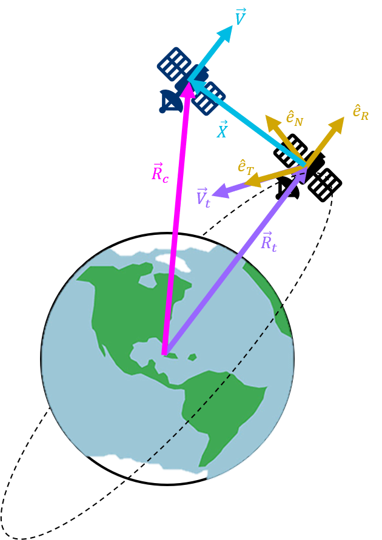

# CWH

## Description

The Clohessy Wiltshire Hill (CWH) environments focus on an active deputy spacecraft anf a passive chief spacecraft. The analysis takes place in Hill's reference frame:

$$
F_H:=(O_H, \hat{e}_R, \hat{e}_T, \hat{e}_N).
$$

The origin of Hill's frame $O_H$ is located at the mass center of the chief, the unit vector $\hat{e}_R$ points away from the Earth along a line connecting the center of Earth to $O_H$, the unit vector $\hat{e}_T$ is aligned with the orbital velocity vector of the chief, and the unit vector $\hat{e}_N$ is normal to $\hat{e}_R$ and $\hat{e}_T$.

The state of the deputy is defined as:

$$
x = [x, y, z, \dot{x}, \dot{y},\dot{z}]^T \in \mathcal{X} \subset \mathbb{R}^{6}
$$

where

$$
r = x \hat{e}_R + y \hat{e}_T + z\hat{e}_N
$$

is the position vector and

$$
v = \dot{x}\hat{e}_R + \dot{y} \hat{e}_T + \dot{z} \hat{e}_N
$$

is the velocity vector of the deputy in Hill's Frame.

The control for the system is defined by

$$
u = [F_x,F_y, F_z]^T=[u_{1},u_{2},u_3]^T \in \mathcal{U} \subset \mathbb{R}^3
$$

*Hill's reference frame centered on a chief spacecraft and used to describe the relative motion of a deputy spacecraft conducting proximity operations (not to scale).*

## Dynamics

A first order approximation of the relative motion dynamics between the deputy and chief spacecraft is given by Clohessy-Wiltshire equations:

$$
\ddot{x} = 2n\dot{y} +3n^2x+ \frac{F_x}{m}
$$

$$
\ddot{y} =-2n\dot{x} + \frac{F_y}{m}
$$

$$
\ddot{z}  = -n^2z+ \frac{F_z}{m}
$$

where $n$ is spacecraft mean motion and $m$ is the mass of the deputy.

## Safety Constraint

A common safety constraint accross all CWH tasks is the dynamic velocity constraint. This constraint restricts the relative velocity of the deputy to a velocity limit that decreases as it approaches the chief. The system is defined to be **safe** if it obeys the following safety constraint for all time:

$$
\varphi_{safety} :=\Vert v_{\rm H} \Vert \leq \nu_0 + \nu_1 \Vert r_{\rm H} \Vert
$$

where,

$$
\nu_0, \nu_1 \in \mathbb{R}_{\geq 0}
$$

and

$$
\Vert {r_{\rm H}}\Vert =(x^2+y^2+z^2)^{1/2}, \quad \Vert {v_{\rm H}} \Vert =(\dot{x}^2+\dot{y}^2+\dot{z}^2)^{1/2}
$$

The above safety constraint enacts a distance-dependent speed limit, with $\nu_0$ defining the maximum allowable docking speed and $\nu_1$ defining the rate at which deputy must slow down as it approaches the chief. The value $\nu_0 = 0.2$ m/s is selected as the maximum velocity at the origin, and the value $\nu_1 = 2n$ ${\rm s^{-1}}$ is selected based on elliptical closed natural motion trajectories (eCNMT).
